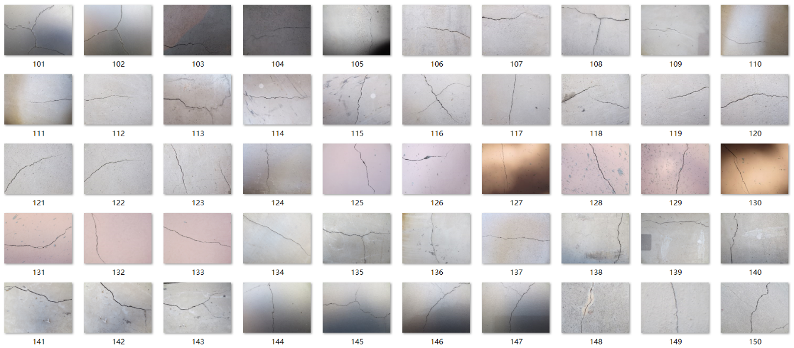
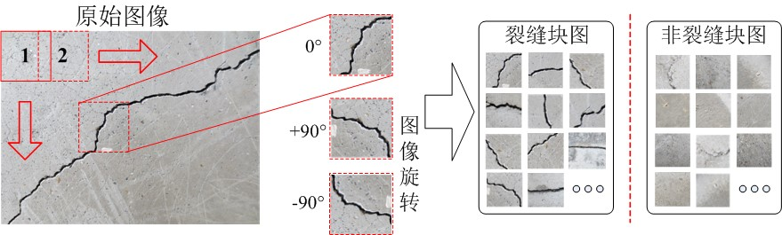
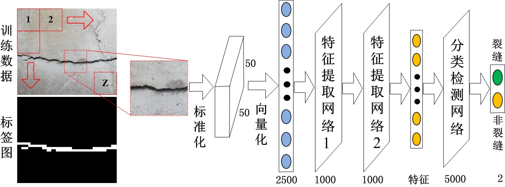
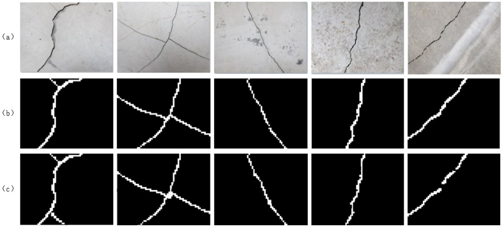
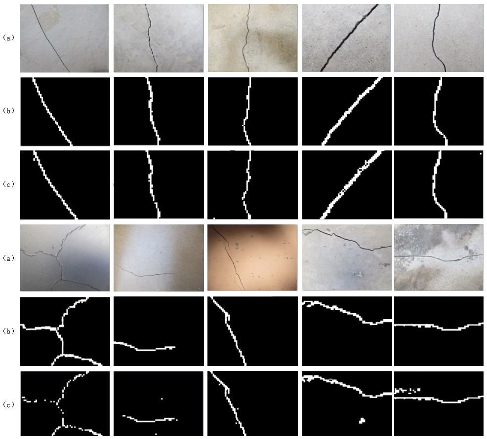

# Crack-detection-based-on-ELM
MATLAB implementation of Crack detection based on [ELM](http://www.ntu.edu.sg/home/egbhuang/).

## Prerequisites
- The results were obtained after training for 15-16 hrs on a 4GB GTX960M.
- The code were tested with Matlab2016b.
- Crack.m:deciding the origin pictures into small pieces.
- spare_elm_autoencoder.m:spare autoencoder for ELM.
## Datasets

## Method
-  the images of the collected concrete cracks are divided and expanded by sliding window and random rotation

- the features of the cracks are quickly learned by the sparse auto-encoded feature extraction network. Next, the online sequential extreme learning machine is used to identify the characteristics of crack defects

## Results

